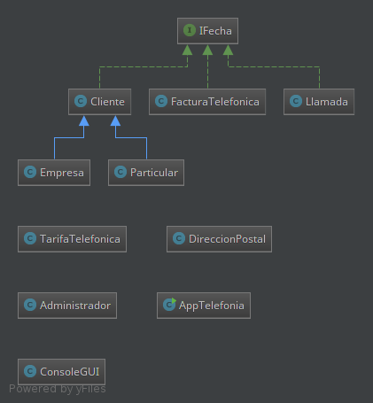

# Telefonia

<p align='justify'>Proyecto en lenguaje <b>Java</b> para la asignatura de <b>Programación Avanzada</b> de la <b>Universidad Jaume I</b></p>

### Autores

- Juan José González ([al341823](mailto:al341823@uji.es "al341823@uji.es"))
- David Agost ([al341819](mailto:al341819@uji.es "al341819@uji.es"))


## Práctica 1: Polimorfismo y Sobrecarga

### Enunciado

<p align='justify'>Desarrollar una aplicación de facturación para una empresa de telefonía móvil, la cual tiene una cartera de clientes. Los clientes pueden ser de dos tipos, o bien empresas, o bien particulares. Cada cliente tiene asignada una tarifa, que inicialmente codificarás como un valor numérico representando el precio por segundo, aunque ésto es algo que evolucionará en posteriores prácticas. De cada uno de los clientes se conoce su nombre, NIF, dirección, correo electrónico, fecha de alta y tarifa (€/min). Además, si el cliente es un particular también se conocen sus apellidos. En las direcciones figura: código postal, provincia y población.</p>

<p align='justify'>Dado que, como te hemos dicho, la forma de codificar las tarifas va a evolucionar en prácticas posteriores, será una buena idea definir una clase Tarifa. Inicialmente la clase sólo contendrá un dato numérico, pero en un futuro contendrá algo diferente. No obstante, si codificas la tarifa en forma de clase, los cambios futuros que tendrás que hacer serán menores.</p>

<p align='justify'>Los clientes efectúan llamadas, por lo que habrá que guardar una relación de todas las llamadas efectuadas. Para cada llamada guardaremos el número de teléfono al que se llamó, la fecha y hora de la llamada y la duración.</p>

<p align='justify'>Cada cliente tiene un conjunto de facturas, cada factura tiene asignada la tarifa en el momento de emitir la factura, aunque un cliente puede cambiar de tarifa cuando lo desee. Por simplificar, el cambio de tarifa se verá reflejado en la siguiente factura. Cada factura tiene asociados: un código único que no puede poseer ninguna otra factura, la tarifa aplicada  (€/min), la fecha de emisión de la factura, el periodo de facturación (de qué fecha a qué fecha) y el importe de la misma. El importe de la factura se calcula a partir de la suma de minutos de las llamadas que ha efectuado el cliente durante el periodo de facturación, y de la tarifa.</p>

<p align='justify'>De cara a la sesión que dedicaremos a Genericidad, te pedimos que las clases <code>Cliente</code>, <code>Factura</code> y <code>Llamada</code> dispongan de un método llamado <code>getFecha()</code>. En el caso de los clientes, este método retornará la fecha de alta del cliente, mientras que en el caso de las facturas, devolverá la fecha de emisión de la factura, y en el caso de las llamadas, devolverá la fecha en la que ésta se efectuó.</p>

### Metodología

<p align='justify'>Con respecto a las acciones que se pueden llevar a cabo en la aplicación y de las que deberá existir alguna opción de menú, para los clientes se deberá poder:</p>

- Dar de alta un nuevo cliente.
- Borrar un cliente.
- Cambiar la tarifa de un cliente.
- Recuperar los datos de un cliente a partir de su NIF.
- Recuperar el listado de todos los clientes.

<p align='justify'> Con respecto a las llamadas:</p>

- Dar de alta una llamada:
- Listar todas las llamadas de un cliente.
- Con respecto a las facturas:

<p align='justify'>Emitir una factura para un cliente, calculando el importe de la misma en función de las llamadas:</p>

- Recuperar los datos de una factura a partir de su código.
- Recuperar todas las facturas de un cliente.

### Diagrama de clases:



> [Ver diagrama de clases completo](./diagrams/DiagramaCompleto.png)

### Cuestionario

1. ¿Cuantas clases has definido?

	* 10

2. ¿Cuantos interfaces has declarado?

	* 1

3. ¿Cuantos paquetes has creado?

	* 5

4. ¿Cuál es el número máximo de argumentos que has utilizado en un método?

	* 2

5. Escribe la declaración de un método con el número máximo de argumentos.

	```java
	public static void cambiarTarifa(String nif, TarifaTelefonica nuevaTarifa) {
		if (exixteCliente(nif))
			CLIENTES.get(nif).setTarifa(nuevaTarifa);
	}
	```

6. ¿Tienes algún método que no recibe argumentos? Si la respuesta es afirmativa escríbelo.

	```java
	public TarifaTelefonica getTarifa() { return this.tarifa; };
	```

7. ¿Todas tus clases tienen definido el constructor por defecto?

	* No

8. Si la pregunta anterior es no, escribe las clases que no tienen constructor por defecto y di por qué has decidido no definirlo.

	* `Administrador`: Porque es una clase con metodos estaticos que se encarga de administrar todas la operaciones
	* `ConsoleGUI`: Porque es una clase con metodos estaticos que sen ecrga de manejar la interfaz de la linea de comandos
	* `AppTelefonia`: Porque es la clase que contiene el metodo `main()`

9. ¿Cuál es el número de líneas de código que tiene tu método más largo?

	* 30

10. ¿Cuál es el número de líneas de código que tiene tu clase más larga?

	* 465 (incluyendo comentarios)

11. Escribe todas las clases que implemeten a algún interface y cual es.

	* `Cliente` implementa el interface `IFecha`
	* `FacturaTelefonica` implementa el interface `IFecha`
	* `Llamada` implementa el interface `IFecha`

12. Escribe todas las clases que extiendan a otra clase y cual es.

	* `Particular` extiende la clase `Cliente`
	* `Empresa` extiende la clase `Cliente`

13. Escribe todas las clases que no implementen ningún interface ni extiendan a otra clase.

	* `TarifaTelefonica`
	* `DireccionPostal`
	* `Administrador`
	* `AppTelefonica`
	* `ConsoleGUI`

14. ¿Tienes algún atributo en alguna clase que no sea `private`? Escribe la clase y el atributo ¿Por qué has decidido que no sea `private`?

	* No

15. ¿Tienes algún método en alguna clase que sea `private`? Indica la clase y el método ¿Por qué has decidido que sea `private`?

	* Si, en `ConsoleGUI` por que son metodos especificos, usados para la comunicación con el usuario mediente la consola, y no necesitan usarse en ninguna otra clase

16. ¿Tienes algún método en alguna clase que sea `protected`? Indica la clase y el método ¿Por qué has decidido que sea `protected`?

	* No

17. ¿Tienes algún método en alguna clase sin modificador de acceso? Indica la clase y el método ¿Por qué has decidido que no tenga modificador de acceso?

	* No
